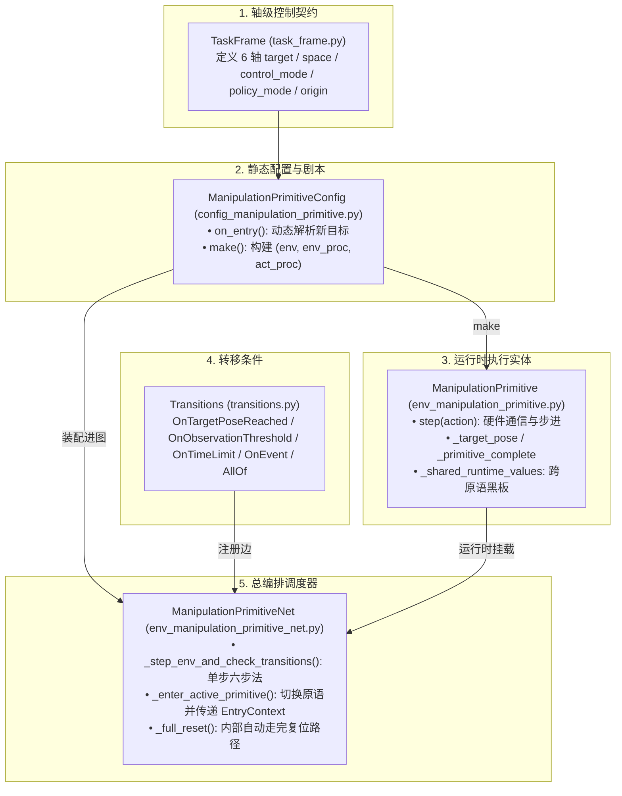

# MP-Net 状态机核心架构学习指南 (Stage 2 Summary)

> 本文档系统总结 `share-rl` 框架中关于 **操作原语网络（Manipulation Primitive Net, MP-Net）** 的五大核心组件、底层物理与数学契约、跨原语数据流转机制以及工程设计模式。

---

## 目录
1. [MP-Net 全景架构图](#1-mp-net-全景架构图)
2. [Step 1: 轴级控制契约 —— `TaskFrame`](#2-step-1-轴级控制契约--taskframe)
3. [Step 2: 原语配置与入口钩子 —— `PrimitiveConfig` 与 `on_entry`](#3-step-2-原语配置与入口钩子--primitiveconfig-与-on_entry)
4. [Step 3: 原语运行时状态 —— `ManipulationPrimitive`](#4-step-3-原语运行时状态--manipulationprimitive)
5. [Step 4: 声明式跳转条件 —— `transitions.py`](#5-step-4-声明式跳转条件--transitionspy)
6. [Step 5: 状态机总调度器 —— `env_manipulation_primitive_net.py`](#6-step-5-状态机总调度器--env_manipulation_primitive_netpy)
7. [关于算法层与 LeRobot 关系的说明](#7-关于算法层与-lerobot-关系的说明)

---

## 1. MP-Net 全景架构图



---

## 2. Step 1: 轴级控制契约 —— `TaskFrame`

**代码文件**：`src/share/envs/manipulation_primitive/task_frame.py`

`TaskFrame` 定义了机械臂末端在 6 个自由度（$x, y, z, rx, ry, rz$）上的控制规范：

### 2.1 核心字段与物理意义

| 字段 | 类型 | 物理意义与作用 |
| :--- | :--- | :--- |
| **`origin`** | `list[float]` (6D) | **任务局部坐标系的原点**（在世界坐标系下的位姿，如孔口表面 $[0.5, 0.2, 0.1, 0, 0, 0]$）。 |
| **`target`** | `list[float]` (6D) | **机械臂末端（TCP）在该任务坐标系中的期望基准位姿**（如 $[0, 0, -0.07, 0, 0, 0]$ 表示深入孔底 7cm）。 |
| **`control_mode`** | `list[ControlMode]` | **任务空间控制器（第 3 层）的控制语义**：<br>• `POS`: DLS 逆运动学求解关节角，刚性位置伺服；<br>• `VEL`: 笛卡尔速度积分推移；<br>• `WRENCH/FORCE`: 顺应力控（真机 `force_mode`）。 |
| **`policy_mode`** | `list[PolicyMode \| None]` | **强化学习策略网络输出如何作用于该轴**：<br>• `None`: 锁定该轴，策略不输出，强制追踪固定 `target`；<br>• `RELATIVE`: 相对增量控制，网络输出映射为速度微调；<br>• `ABSOLUTE`: 绝对坐标控制（配合流形升维编码）。 |
| **`space`** | `ControlSpace` | `TASK`（笛卡尔 6D 空间）或 `JOINT`（关节角度空间）。 |

### 2.2 动作维度推断与流形编码规则
- 只有 `policy_mode != None` 的轴才是策略可学轴；
- **相对控制（`RELATIVE`）**：平移轴与旋转轴均占 **1 维**；
- **绝对旋转（`ABSOLUTE`）**：自动进行流形连续编码，避免万向节死锁与角度跳变：
  - 1 个绝对旋转轴 $\to$ $S^1$（$\cos\theta, \sin\theta$，占 2 维）；
  - 2 个绝对旋转轴 $\to$ $S^2$（单位球面向量，占 3 维）；
  - 3 个绝对旋转轴 $\to$ $SO(3)$ 6D 连续表示（占 6 维）。

---

## 3. Step 2: 原语配置与入口钩子 —— `PrimitiveConfig` 与 `on_entry`

**代码文件**：`src/share/envs/manipulation_primitive/config_manipulation_primitive.py`

### 3.1 核心设计原则
> **“Configs 描述行为，但绝不持有运行时状态；运行时状态 100% 属于 Env。”**
- Config 是**静态剧本**（可序列化存储）；
- Env 是**运行现场**（持有真实的机器人连接与实时物理状态）。

### 3.2 状态切换桥梁：`PrimitiveEntryContext`
状态机跳转瞬间，系统打包传递上下文：
```python
@dataclass(slots=True)
class PrimitiveEntryContext:
    source_primitive: str | None    # 上一个原语名称 (如 "transport")
    target_primitive: str | None    # 目标原语名称 (如 "insert")
    observation: dict[str, Any]     # 切出瞬间的实测传感器观测 (含局部相对位姿)
    task_frame_origin: dict[str, list[float] | None] # 上一个原语的原点
    reason: str | None              # 触发跳转原因 (如 "peg_inserted", "time_limit")
```

### 3.3 为什么必须保存 `task_frame_origin`？（坐标中转机制）
`observation` 中记录的末端位姿是**相对于上一个原语原点的局部坐标**。当切换到新原语时，必须经过两步解包：
$$\mathbf{P}_{\text{world}} = \text{task\_pose\_to\_world\_pose}(\mathbf{P}_{\text{obs}}, \text{previous\_origin})$$
$$\mathbf{P}_{\text{new\_frame}} = \text{world\_pose\_to\_task\_pose}(\mathbf{P}_{\text{world}}, \text{current\_frame.origin})$$

### 3.4 常用原语类型
- **`primitive`**：基础静态目标原语；
- **`move_delta`**：相对位移原语，在 `on_entry` 时根据当前位置 + `delta`（在 `"world"` 或 `"ee"` 系下）动态计算新目标点；支持 `absolute_axes` 锁定某些轴的高度/姿态；
- **`open_loop_trajectory`**：多步插值开环轨迹，在内部平滑走完固定时长的动作；
- **`zero_ft`**：六维力传感器硬件清零原语；
- **`foundationpose`**：视觉 6D 位姿估计原语。

---

## 4. Step 3: 原语运行时状态 —— `ManipulationPrimitive`

**代码文件**：`src/share/envs/manipulation_primitive/env_manipulation_primitive.py`

### 4.1 运行时持有状态
- `_target_pose`：当前实时的 6D 目标；
- `_primitive_complete`：当前原语是否自主执行完毕；
- `_trajectory_progress`：插值进度（$0.0 \sim 1.0$）；
- `_shared_runtime_values`：**跨原语共享黑板**（如原语 A 存入估计的 `object_pose`，原语 B 读取作为原点）。

### 4.2 单步执行五步法
1. `apply_task_frames()`：同步 TaskFrame 给机器人控制器；
2. `robot.send_action(...)`：物理/仿真硬件执行；
3. `_get_observation()`：读取最新图像、关节角与力传感器；
4. `current_step += 1`：累加步数；
5. 返回 `(obs, reward=0.0, terminated=False, truncated=False, info)`。
*(注：终止与奖励判定完全移交给上层 MP-Net)*

---

## 5. Step 4: 声明式跳转条件 —— `transitions.py`

**代码文件**：`src/share/envs/manipulation_primitive_net/transitions.py`

所有条件继承自 `Transition`，实现 `evaluate(obs, info) -> Outcome`：

```python
@dataclass
class Outcome:
    reward: float = 0.0       # 触发跳转时发放的额外奖励 (如 +1.0)
    terminated: bool = False  # 正常完成跳转
    truncated: bool = False   # 超时截断跳转
    reason: str | None = None # 触发原因
```

### 内置 8 种 Transition 工具箱
1. **`OnTargetPoseReached`**：末端实际位姿与目标点差值 $\le \text{tolerance}$（含欧拉角环绕处理）；
2. **`OnObservationThreshold`**：数值比较（如 `depth >= 0.07`）；
3. **`OnTimeLimit`**：步数超限触发，返回 `truncated=True`；
4. **`OnEvent / OnSuccess / OnFailure`**：检查 `info` 中的布尔事件位（按键/脚踏开关/完成标志）；
5. **`AllOf`**：逻辑“与”组合器（所有子条件同时满足才触发）；
6. **`Always`**：单步无条件直接跳转；
7. **`RecordWorldPoseTransition`**：触发时将当前世界位姿追加写入 JSONL；
8. **`RewardClassifierTransition`**：预训练神经网络成功分类器。

---

## 6. Step 5: 状态机总调度器 —— `env_manipulation_primitive_net.py`

**代码文件**：`src/share/envs/manipulation_primitive_net/env_manipulation_primitive_net.py`

### 6.1 单步流转：`_step_env_and_check_transitions` 六步法
```
[1. Action 流水线]  ──► 将网络动作反归一化 (若有人工干预则覆盖为手柄动作)
        ↓
[2. Env 物理步进]   ──► 当前激活原语 env[active].step() 执行
        ↓
[3. 干预动作捕获]   ──► 记录 teleop_action 供 DAgger 训练
        ↓
[4. Obs 流水线]     ──► 图像裁剪缩放、力觉与状态特征拼接
        ↓
[5. 组装 Info 字典] ──► 注入 step, primitive_step, transition_from
        ↓
[6. 转移碰撞检测]   ──► 遍历当前原语的出边 transitions[active]:
                        if transition.evaluate() 触发:
                            • 打包 PrimitiveEntryContext
                            • self._active = target
                            • 调用 target.on_entry() 重新锚定坐标与目标
                            • 注入 reward, done, truncated
```

### 6.2 拓扑校验与整集复位
- **拓扑校验（`__post_init__`）**：在启动时运行 BFS 算法，确保所有非终态原语有出边、所有终态原语从 `start` 可达；
- **整集复位（`_full_reset`）**：在内部自动单步推演 `reset_primitive -> start_primitive` 的子路径，对外暴露干净的 `obs = net.reset()`。

---

## 7. 关于算法层与 LeRobot 关系的说明

### 核心结论
**`share-rl` 并非“没有任何强化学习算法”，而是“站在 LeRobot 的肩膀上进行了深度定制与关键扩展”**。

```
┌─────────────────────────────────────────────────────────────┐
│ share-rl 专有强化学习与交互层                               │
│ • SACDaggerBCPolicy (扩展了行为克隆损失 L_bc, MSE/NLL 支持) │
│ • 双缓冲 RLPD 混合采样 (50% 在线交互 + 50% 离线示范/干预)    │
│ • 分布式 Actor-Learner 通信与流式参数同步 (gRPC / ZMQ)     │
│ • 力安全回退过滤器 (ForceBackoffSafetyFilter)                │
│ • MP-Net 局部可学子空间动作投影 (TaskFrame Action Processor)│
└──────────────────────────────┬──────────────────────────────┘
                               │ 继承并调用
┌──────────────────────────────▼──────────────────────────────┐
│ LeRobot 基础算法库 (lerobot.policies.sac)                    │
│ • 基础 SACPolicy / SACConfig                                 │
│ • 双 Q 网络 (Critic Ensemble) 与 策略网络 (Actor) 骨架      │
│ • 基础重参数化采样 (TanhMultivariateNormalDiag)             │
│ • 自动温度调节 (Alpha / Temperature)                         │
└─────────────────────────────────────────────────────────────┘
```

1. **基础算法组件（来自 LeRobot）**：
   - 依赖 `lerobot.policies.sac` 提供的标准 SAC 骨架、Q 价值网络与 Actor 结构。
2. **`share-rl` 的核心自主扩展**：
   - **`SACDaggerBCPolicy`**（`src/share/policies/sac_dagger/`）：在 SAC 基础上增加了人机协同干预的行为克隆损失函数（$\mathcal{L}_{\text{BC}}$），使得策略在探索偏离时能通过人类示范快速拉回；
   - **双 Replay Buffer 架构**（`learner_server.py`）：实现了类似 RLPD 的 $50\%$ 在线 $+ 50\%$ 离线混合批量训练；
   - **力安全与子空间投影**：将高维连续动作空间严格限制在 `TaskFrame` 规定的可学轴内，并接入了力超限回退保护。
