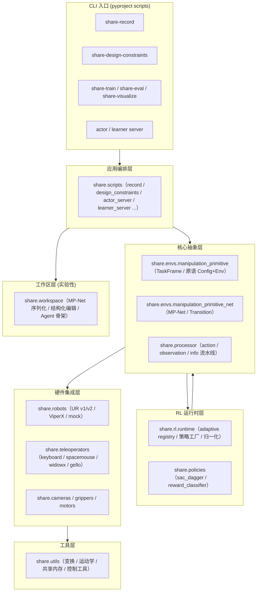
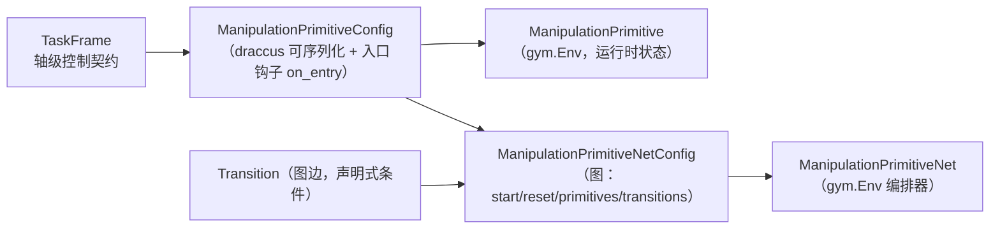
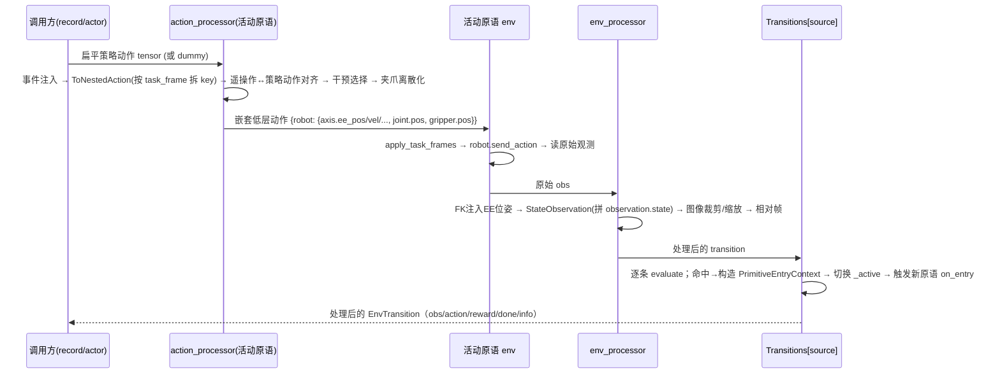

# share-rl 框架大纲

> 基于源码精读整理（2026-08-21）。项目定位：**LeRobot 的结构化操作扩展**——用"操作原语图（MP-Net）"把抓取、插拔等接触密集任务组织为可编程、可训练、可人机协作（HIL）的流水线。核心思路与 SHaRe-RL / HIL-SERL 一脉相承：**策略只负责学习局部可学子空间（adaptive axes），其余轴由任务帧（task frame）声明式固定**。

---

## 1. 顶层分层



---

## 2. 核心抽象链（从契约到运行时）



### 2.1 TaskFrame —— 单机器人轴级控制契约

- 字段：`target`（6D 目标姿态 / 关节目标）、`space`（`TASK`/`JOINT`）、`policy_mode`（每轴 `ABSOLUTE`/`RELATIVE`/`None`）、`control_mode`（每轴 `POS`/`VEL`/`WRENCH`）、`origin`（任务帧原点，世界坐标）、`min_pose`/`max_pose`（每轴边界）、`controller_overrides`、`joint_names`。
- **只有 `policy_mode != None` 的轴是策略可学的**（`learnable_axis_indices` / `is_adaptive`）。
- 策略动作维度由"可学轴"推断，关键设计是**绝对旋转轴的流形编码**：

$$\text{dim} = \sum_{\text{非绝对旋转轴}} 1 \;+\; \begin{cases}2 & \text{1 个绝对旋转轴 }(S^1)\\3 & \text{2 个 }(S^2)\\6 & \text{3 个 }(SO(3)\text{ 6D 表示})\end{cases}$$

对应学习空间的 key：单轴 `{axis}.pos.cos/.sin`、双轴 `rotation.s2.x/y/z`、三轴 `rotation.so3.a1/a2.*`。

### 2.2 ManipulationPrimitiveConfig / Env —— 配置与运行时分离

- **Config 拥有入口期逻辑**（`on_entry` 写目标进 env、`resolve_targets` 算入口/目标位姿、`make` 构建 env + 双流水线），**Env 拥有运行时状态**（`_target_pose`、`_primitive_complete`、`_trajectory_progress`、共享 runtime values）。
- 内置注册子类（draccus ChoiceRegistry）：
  | type | 说明 |
  |---|---|
  | `primitive` | 基类：入口把 `task_frame.target` 写入 env |
  | `zero_ft` | 脚本化：保持入口位姿 → 重新零力/力矩 → 完成 |
  | `move_delta` | 入口按 `delta`（world/ee 帧）+ `absolute_axes` 解析固定 POS 轴目标 |
  | `open_loop_trajectory` | 脚本化开环轨迹：`target` 或 `delta` + `duration_s`，按内/外环频率切子步 |
  | `foundation_pose` | 视觉位姿估计原语（见 §7） |
- 每原语构建产出 `(env, env_processor, action_processor)` 三元组，安装进 MP-Net。

### 2.3 MP-Net —— 图编排器

- `ManipulationPrimitiveNetConfig`：`start_primitive` / `reset_primitive` / `primitives{}` / `transitions[]` / `fps` / `robot` / `teleop` / `cameras`。
- `__post_init__` 做图不变量校验：转移源/目标存在、非终态原语必须有出边、**终态原语必须从 start 可达**（BFS）。
- `ManipulationPrimitiveNet(gym.Env)` 运行时：`connect()` 连接全部硬件 → 为每个原语 `make()` → 按 source 建转移索引 → `_active` 当前原语。`reset()` 区分**整集重置**（`reset_primitive` 起步，沿图自动走到 `start_primitive`）与**切换进下一原语**。

### 2.4 Transition —— 声明式图边

统一接口 `evaluate(obs, info) -> Outcome(reward, terminated, truncated, reason)`，已注册子类：

| type | 触发条件 |
|---|---|
| `always` | 无条件 |
| `on_event` / `on_success` / `on_failure` | info 中布尔事件位（键盘/脚控映射） |
| `on_observation_threshold` | 观测标量与阈值比较 |
| `on_time_limit` | 步数上限（truncate） |
| `on_target_pose_reached` | EE 位姿到达 `primitive_target_pose`（带旋转 wrap 容差） |
| `reward_classifier` | 预训练奖励分类器给出成功概率 ≥ 阈值 |
| `on_info_equals` / `all_of` / `record_world_pose` | 通用比较 / AND 组合 / 记录世界位姿包装器 |

---

## 3. 单步数据流（MP-Net.step 五段式）



关键处理步骤一览：

**动作侧 `make_action_processor`（顺序即数据流）：**
`AddKeyboard/Footswitch/TeleopEventsAsInfo` → `AddTeleopActionAsComplimentaryData`（干预时读遥操作）→ `ToNestedActionProcessorStep`（扁平 tensor 拆成按 key 的字典）→ `MatchTeleopToPolicyActionProcessorStep`（把遥操作归一化到策略学习空间：delta 遥操作直接对齐；绝对关节遥操作经 FK 差分）→ `InterventionActionProcessorStep`（干预时用遥操作覆盖策略动作，否则把学习空间动作投影回完整任务帧命令，含绝对旋转流形解码）→ `DiscretizeGripperProcessorStep` → （可选）`RelativeFrameActionProcessor` / `ToJointActionProcessorStep`（非任务帧机器人经 IK 转关节命令）。

**观测侧 `make_env_processor`：**
`JointsToEEObservation`（FK 注入 `{robot}.{axis}.ee_pos`）→ `StateObservationProcessor`（按 per-robot 配置拼 `observation.state`，支持数值微分速度、帧堆叠）→ `ImageObservationProcessor`（裁剪/缩放/归一化）→ `DeviceProcessorStep` → （可选）`RelativeFrameObservationProcessor`。

**干预（HIL）语义**：`TeleopEvents.IS_INTERVENTION` 为真时，动作流水线读取遥操作输入并覆盖策略输出；`rl.is_intervention` 标记写入数据集/回放缓冲——这是 DAgger 离线缓冲的数据来源。

---

## 4. 工作区层 `share.workspace`（实验性）

- `mpnet.py`：MP-Net 配置的**纯数据层**——`create_template_mpnet` / `load_mpnet_config`（draccus JSON 解析，带无依赖 fallback） / `save_mpnet_config` / `validate_mpnet_config` / `summarize_mpnet(_debug)` / 结构化编辑函数（`add_primitive`、`remove_primitive`、`set_learnable_axes`、`set_axis_targets`、`add_transition`、`attach_policy`…）统一由 `apply_edit(operation, arguments)` 分发。
- `runtime.py`：`AgentRuntime`——受控的 LLM 工具代理骨架（`handle_user_message` / `confirm_pending`，max_tool_rounds 限制、关键操作需确认）。
- ⚠️ **不完整**：`runtime.py` 引用的 `providers.py` / `store.py` / `tools.py` 在当前 checkout 不存在；README 亦声明 `share-workspace` CLI 处于变动中。

---

## 5. RL 运行时 `share.rl` 与策略 `share.policies`

### 5.1 分布式 SAC Actor/Learner（HIL 在线学习）

```mermaid
flowchart LR
    subgraph ACTOR["Actor 进程（真机侧）"]
        RA[ManipulationPrimitiveNet]
        RP[每原语 SAC 策略 eval]
        RQ1[(parameters_queue)]
        RQ2[(transitions_queue)]
        RQ3[(interactions_queue)]
    end
    subgraph LEARNER["Learner 进程（训练侧）"]
        LQ[(transition_queue)]
        LB[每原语 ReplayBuffer<br/>online + offline(干预段)]
        LO[优化循环<br/>critic/actor/temperature + BC-DAgger]
        LS[gRPC LearnerService]
        LQ2[(parameters_queue)]
    end
    ACTOR -- "gRPC 流式 SendTransitions" --> LS
    LS --> LQ --> LB --> LO
    ACTOR -- "gRPC StreamParameters" --> LS
    LQ2 --> RQ1
```

- `share.rl.runtime.build_adaptive_registry`：从 MP-Net 配置收集**自适应且带 SAC policy 的原语**（自动排除 `reset_primitive`），每个原语一份策略配置与 `online_steps` 预算；`PrimitiveBudgetCounter` 按原语统计交互步数。
- `make_policies_for_registry` / `make_policy_processors`：保证 actor 与 learner 共用同一策略构建与归一化（pre/post processor）代码路径，避免两端漂移。
- Learner 的离线缓冲有两条来源：**(A)** resume 时从 on-policy 数据集重建 `is_intervention=True` 的转移；**(B)** 外部离线演示数据集（`offline-demos/{primitive}`）。
- `SACDaggerBCPolicy`（`sac_dagger`）：在 SAC 上叠加 BC 更新——对干预段离线数据做行为克隆，损失为
$$L_{bc} = -\mathbb{E}_{(s,a)\sim D_{off}}\big[\log \pi_{\theta}(a\mid s)\big], \quad \text{另报告 } \mathrm{MSE}(\pi_{\theta}(s), a)$$
- `StateRewardClassifier`：标准图像分类器 + 状态分支 MLP，供 `reward_classifier` 转移与 `train_reward_classifier.py` 训练（成功 episode 尾部帧标正样本）。

---

## 6. 脚本入口与配置

| CLI | 模块 | 说明 |
|---|---|---|
| `share-record` | `scripts/record.py` | 核心录制循环：策略/遥操作切换、按原语一个数据集、干预段可选单独保存 |
| `share-design-constraints` | `scripts/design_constraints.py` | 交互式标定任务帧原点与 min/max 边界（热键 o/r/p/s/q） |
| `share-train` | `scripts/train.py` | ⚠️ **文件缺失**，CLI 已声明但不可用 |
| `share-eval` | `scripts/eval_on_dataset.py` | 离线单集多策略对比（硬编码 `POLICY_SPECS`，依赖外部 `beast_refiner` 包） |
| `share-visualize` | `scripts/visualize.py` | 薄封装 LeRobot 数据集可视化 |
| （无 CLI） | `scripts/actor_server.py` / `learner_server.py` | 分布式训练两端 |
| （无 CLI） | `scripts/train_reward_classifier.py` / `measure_wrench.py` | 奖励分类器训练 / 末端力可视化 |

配置层：`configs/record.py`（`RecordConfig`，含 OU 探索噪声）、`configs/rl.py`（`MPNetTrainRLServerPipelineConfig`）、`configs/mpnet.py`（`DatasetRecordConfig` / `TrainRLServerPipelineConfig`）、`configs/design_constraints.py`、`configs/measure_wrench.py`。

---

## 7. 硬件集成层

| 模块 | 类型 | 要点 |
|---|---|---|
| `robots/ur`（v1） | 任务帧机器人 | `RTDETaskFrameController` 独立进程 1kHz RTDE 环 + `SharedMemoryQueue/RingBuffer` IPC；`send_action` 锁控制空间；力模式/简单位姿/关节力矩多输出路径 |
| `robots/ur_v2` | 任务帧机器人 | 控制器可插拔（ChoiceRegistry）：`ForceModeController`（复刻 v1 forceMode）与 `DirectTorqueController`（**绕过 UR 2kHz 导纳层**，$\tau = J(q)^\top F_{world}$ 直接力矩，适合接触任务） |
| `robots/viperx` | 纯关节机器人 | Dynamixel 串口，9 电机含 shadow 同步 |
| `teleoperators/delta_keyboard` | delta 速度 | `{x,y,z,rx,ry,rz}.vel` 命名空间 + 任意事件绑定 |
| `teleoperators/spacemouse` | delta 速度 | HID 读线程独立进程；按钮映射事件 |
| `teleoperators/widowx` | 绝对关节 | ViperX 同构遥操作 |
| `teleoperators/gello` | 绝对关节 | 注意 `name="widowx"`，calibrate/send_feedback 为 stub |
| `cameras` | — | RealSense 深度（内参/深度转米）、Mock |
| `grippers/robotiq_controller` | — | 独立进程 TCP（63352）驱动 2F-85 |
| `primitives/foundationpose` | 视觉原语 | 深度相机 + FoundationPose 估位姿 → 手眼标定 → 写 runtime value `object_pose` → 按容差写 SUCCESS/FAILURE |

任务帧下发链路（重要）：`UR.set_task_frame` 只更新 wrapper 内状态；真正的下发发生在每次 `send_action()` 时填充 `TaskFrameCommand` → `controller.send_cmd()` → 共享内存队列 → RTDE 子进程执行。

---

## 8. 工具层 `share.utils`

- `transformation_utils.py`：旋转流形工具（extrinsic XYZ Euler、S1/S2/SO(3) 6D 编解码）、任务帧↔世界坐标变换、delta 位姿合成、CCW 弧区间（旋转边界约束）、观测位姿读取。
- `kinematics.py`：`RobotKinematics`（URDF）与 `MRKinematics`（modern_robotics 空间旋量，vx300s/wx250s 预置模型）。
- `control_utils.py`：`make_policies_and_datasets`（按原语建数据集 + 策略 + pre/post processor）、`predict_action`（推理统一入口）、`make_step_timing_hooks`、`MPNetStepCounter`。
- `shared_memory.py`：`SharedMemoryQueue`/`SharedMemoryRingBuffer`/`SharedNDArray` 等零拷贝 IPC 原语。
- 其他：`env_config_snapshot`（数据集随附 env 配置快照）、`video_utils`（多数据集视频批量编码）、`logging_utils`、`device`、`mock_utils`、`constants`。

---

## 9. 目录总览（`src/share` 包）

```
share/
├── envs/
│   ├── manipulation_primitive/        # TaskFrame、原语 Config（含子类注册）、原语 Env
│   ├── manipulation_primitive_net/    # MP-Net Config/Env、Transitions
│   └── utils.py                       # per-robot 归一化、入口位姿解析、比较工具
├── processor/                         # action / observation / info 三步流水线步骤
├── workspace/                         # MP-Net 配置序列化/编辑/摘要 + Agent 骨架（不完整）
├── rl/runtime.py                      # adaptive registry、策略工厂、归一化对齐、参数同步
├── policies/                          # sac_dagger（BC-DAgger）、reward_classifier
├── scripts/                           # record / design_constraints / actor / learner / eval / ...
├── robots/                            # ur(v1/v2)、viperx、mock
├── teleoperators/                     # delta_keyboard、spacemouse、widowx、gello
├── cameras/ grippers/ motors/         # RealSense 深度、Robotiq、Dynamixel 总线
├── primitives/                        # foundation_pose 视觉原语
├── configs/                           # record / rl / mpnet / design_constraints / measure_wrench
├── utils/                             # 变换 / 运动学 / 控制工具 / 共享内存 / 快照 / 日志
└── debug/                             # MPNetDebugger
```

项目根：`src/experiments/`（`ur5e_foundationpose_pick`、`demo_ur3e_teleop_fiddle_out` 两个实验 env）、`tools/`（手眼标定 CLI、SAM3 客户端）、`wiki/`（Sphinx 架构文档）、`tests/`（34 个测试）、`calibration/`、`examples/`（13 个示例）。

---

## 10. 值得注意的问题与坑（源码事实）

1. **`share-train` 指向不存在的 `scripts/train.py`**；`share-workspace` 指向不存在的 `scripts/robot_workspace.py`。
2. `workspace/runtime.py` 引用不存在的 `providers/store/tools` 模块——Agent 运行时仅是骨架。
3. `share/primitives/foundationpose.py` 与 `src/experiments/envs/foundationpose/primitives.py` 注册了相同的 4 个 primitive 子类名（`foundation_pose` 等），同时导入存在注册冲突风险。
4. `teleoperators/gello` 的 `name="widowx"` 与 WidowX 同名，且 `calibrate()`/`send_feedback()` 是 stub。
5. `design_constraints.py` 中 `save()`/`reset_bounds()` 多处调用被注释禁用——"保存"实际不生效。
6. `eval_on_dataset.py` 硬编码策略路径并依赖外部 `beast_refiner` 包，非通用评估工具。
7. 根 `README` 与 `AGENTS.md` 声明 `share.scripts.train` 可用，与实际源码不符（README 声称的 4 个 CLI 中 train 失效）。
8. v1/v2 控制器均有 `DirectTorqueController` 这种接触任务取向的输出路径，但默认仍走 forceMode——切换需显式配置 `--env.robot.controller.type=direct_torque`。
